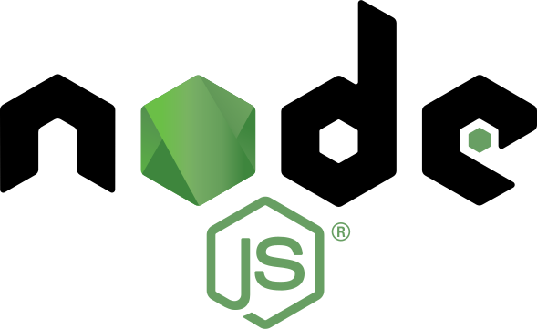

# Introduction
## Presentation <a name="present"></a>
<center>

</center>

Node.js® est un environnement d’exécution JavaScript construit sur le moteur JavaScript V8 de Chrome. Node.js utilise un modèle basé sur l’événementiel et des entrées/sorties non bloquantes, ce qui le rend léger et efficace. L’écosystème de logiciels de Node.js, npm, est le plus grand écosystème de bibliothèques open source au monde avec plus de 700 000 modules.

## Node.js Background <a name="background"></a>

## Installer Node.js <a name="install"></a>
### Les versions
Node.js® est livré dans différentes version avec des tags particulier qui sont LTS et latest
* LTS: Long Time Support
    La version de support a long terme qui ne possède pas toutes les fonctionnalité de la dernière version mais qui permet un support plus long de la part de la communauté Node.js®.
    Celle-ci est recommandé pour la plupart des utilisateurs.
* latest: Dernier build
    La dernière version embarque les dernières fonctionnalité mais elle est potentiellement moins stable que la LTS.

La procedure d'install de nodejs est disponible sur leur site: [https://nodejs.org/fr/download/](https://nodejs.org/fr/download/)

## Tache asynchrone <a name="async"></a>
En Node.js® les taches sont définie en asynchrone. C'est a dire que l'execution du code continue lorsque celle-ci execute des fonctions non bloquante.

```js
// file system module
var fs = require("fs");
fs.readFile("test.js", function(err, content) {
  if (err) {
    console.err(err);
  } else {
    console.log("file read: " + content.length + " bytes");
  }
});
console.log("after readFile");
```
Concrètement le fichier est lu et rend la main au programe, qui continue et affiche "after readFile" avant que celui-ci est réellement lu.
Output: 
```bash
$ node test.js
after readFile
file read: 217 bytes
```

## Différentes manière de faire de l'asynchrone

### Callbacks
```
var fs = require("fs");
const path = require('path');

class Reader {

  read (callback) {
    fs.readFile(path.resolve(__dirname, "callback.js"), function(err, content) {
      if (err) {
        console.error(err);
      } else {
        callback("file read: " + content.length + " bytes");
      }
    });
  }
}

new Reader().read((result) => {
  console.log(result);
});
console.log("after readFile");
```

### async await

### Promises
```js
class Test {
    
    promise () {
        return new Promise( (resolve, reject) => {
            var fs = require("fs");
            fs.readFile("promises.js", function(err, content) {
              if (err) {
                reject({message: 'not ok', error: err});
              } else {
                resolve("file read: " + content.length + " bytes");
              }
            });
            
        });
    }


    run () {
        console.log("Start file read");
        this.promise().then( (message) => {
            console.log(message);
            console.log("End file read");
        }).catch(error => console.error(error));
    }
}

new Test().run();
console.log("A log asynchronous");
```

## Conclusion <a name="conclusion"></a>

C'est une plateforme logicielle libre et événementielle orientée vers les applications réseau qui doivent pouvoir monter en charge. D'où la grande importance de l'asynchrone (nodejs est monothread). Elle utilise la machine virtuelle V8 (moteur de chrome).

Parmi les modules natifs de Node.js, on retrouvera http qui permet le développement de serveur HTTP. Il est donc possible de se passer de serveurs web Nginx / Apache.

Concrètement, Node.js est un environnement bas niveau permettant l’exécution de JavaScript côté serveur.

* Il y a beaucoup de façons d'écrire du code en nodejs, cela dépend de votre propre expérience et de vos propres goûts, tout est histoire de mode et de lisibilité.
